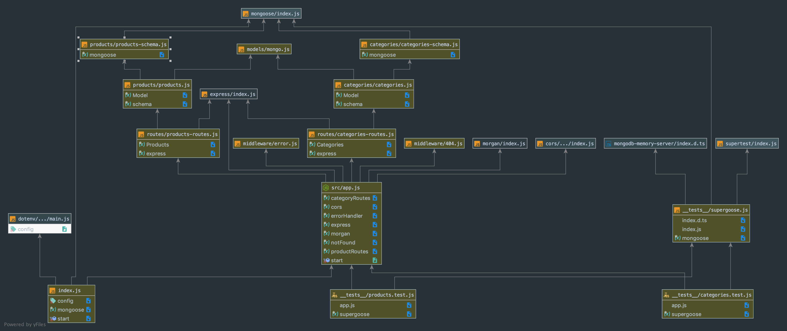

# LAB - 08

## Express

### Author: Josh Nebe 

### Links and Resources
* [submission PR](https://github.com/yosh-401-advanced-javascript/401-lab-08/pull/1
* [travis](http://xyz.com)
* [front-end](http://xyz.com) (when applicable)

#### Documentation
*

### Modules
#### `app.js`
#### `models`
####    `categories`
####    `products`
####    `mongo.js`
#### `routes`
#### `src`
####    `middleware`
####    `app.js`
#### `.env`
#### `index.js`
####    
##### Exported Values and Methods

###### `start() -> starts listening`

### Setup
#### `.env` requirements
* `PORT` - Port Number

#### Running the app
* `npm start`
* Endpoint: `/categories`
  * Returns a JSON object with category objects in it.
  * Endpoint: `/products`
    * Returns a JSON object with products objects in it.
  
#### Tests
* `npm run test`

#### UML

